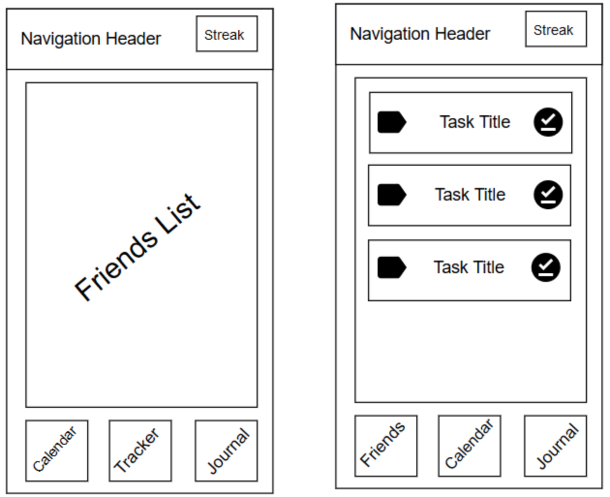
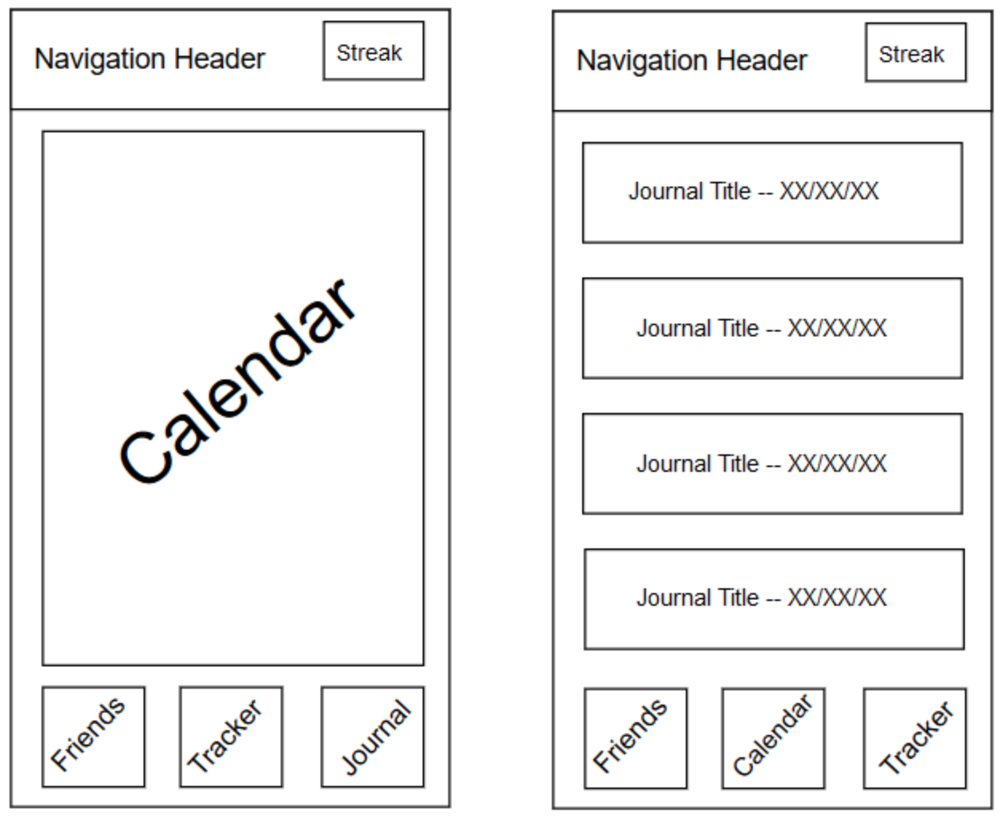

# fxHabit
Submitted by: **Gurpreet Sidhu**, **Paul Whipp**, **David Duong**, and **Yazmin Carrillo**

## Table of Contents
1. [Overview](#Overview)
1. [Product Spec](#Product-Spec)
1. [Wireframes](#Wireframes)
1. [Tasks](#Tasks)
1. [Milestones](#Milestones)

## Overview
### Description
You are what you do every day. Our application focuses on the building blocks of skill - routines. Perfect your daily routine, share your success with your friends, and tweak your routines into perfection. Friends can view your progress and help hold you accountable!

### App Evaluation
- **Category:** Social Networking / Productivity
- **Mobile:** This app would be primarily developed for mobile
- **Story:** Promotes the creation of user habits through a miniaturized task-based structure. Tasks are aggregated over time to create a sense of progression for the user, and task completion is tracked daily through journals.
- **Market:** Any individual could choose to use this app, and to keep it a safe environment, people would have to add their friends
- **Habit:** This app could be used as often or unoften as the user wanted depending on habits they want to improve or helping their friends keep their goal. 
- **Scope:** This app is a short term task list to encourage productivity without unnecessary engagement. There are no plans to add a large feature list currently. By keeping the features limited the app will stayed focused on its intended use. 

## Product Spec
### 1. User Stories (Required and Optional)

**Required Must-have Stories**

* User logs in to access friends list, calendar, tracker, journal, and settings
* User creates their daily and weekly goals in the tracker
* User is able to see streak on calendar 
* User is able to view previous progress in journal
* User is able to share goals with friends 
* Settings (Accesibility, Notification, General, etc.) 

**Optional Nice-to-have Stories**

* Graph to compare streaks between friends

### 2. Screen Archetypes

* Login or Register - User signs up or signs into account
  * Upon Download/Opening of the application, the user is prompted to log in to gain access to their profile
* Friends Screen 
  * Able to look upon friends' tracker and send reminders 
* Calendar Screen
  * Able to see streak on calendar view 
* Tracker Screen 
  * Able to create daily and weekly goals
* Journal Screen 
  * Able to view previous dayly (or weekly?) summary of goals met
* Settings Screen 
  * Able to change notifications

### 3. Navigation

**Tab Navigation** (Tab to Screen)

* Friends List
* Tracker
* Calendar
* Journal
* Settings 

Optional:
* Calendar 

**Flow Navigation** (Screen to Screen)
* Forced Log-in -> Account creation if no log in is available

## Wireframes

### [BONUS] Digital Wireframes & Mockups
* Digital version of storyboards (demo and snapshot of each screen) 

### [BONUS] Interactive Prototype
* GIF of app demo 

## Tasks
* Detailed task for each member

## Milestones
* Have Login, Task List, and Journal and associated storyboard layouts created - 04/09/2020
* Set up database and create logic to add to database (tasks and journal entries) - 04/13/2020
* Display data onto storyboards (tasks and journal) - 04/15/2020
* Testing and debugging phase: review and polish layout - 04/17/2020

* Have Calendar, Friends List, and Add A Friend storyboard layouts created - 04/23/2020
* Set up additional tables in the database and inject data from app - 04/27/2020
* Display data onto storyboards - 04/29/2020
* Testing and debugging phase: review and polish layout - 05/01/2020

