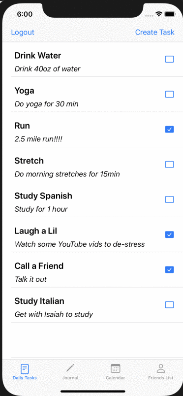

# fxHabit
Submitted by: **Gurpreet Sidhu**, **Paul Whipp**, **David Duong**, and **Yazmin Carrillo**

## Table of Contents
1. [Overview](#Overview)
1. [Product Spec](#Product-Spec)
1. [Wireframes](#Wireframes)
1. [Schema](#Schema)
1. [Tasks](#Tasks)
1. [Milestones](#Milestones)

## Overview
### Description
You are what you do every day. Our application focuses on the building blocks of skill - routines. Perfect your daily routine, share your success with your friends, and tweak your routines into perfection. Friends can view your progress and help hold you accountable!

### App Evaluation
- **Category:** Social Networking / Productivity
- **Mobile:** This app would be primarily developed for mobile
- **Story:** Promotes the creation of user habits through a miniaturized task-based structure. Tasks are aggregated over time to create a sense of progression for the user, and task completion is tracked daily through journals.
- **Market:** Any individual could choose to use this app, and to keep it a safe environment, people would have to add their friends
- **Habit:** This app could be used as often or unoften as the user wanted depending on habits they want to improve or helping their friends keep their goal. 
- **Scope:** This app is a short term task list to encourage productivity without unnecessary engagement. There are no plans to add a large feature list currently. By keeping the features limited the app will stayed focused on its intended use. 

## Product Spec
### 1. User Stories (Required and Optional)

**Required Must-have Stories**

- [x] User logs in to access friends list, calendar, tracker, and journal
- [x] User creates their daily and weekly goals in the tracker
- [x] User is able to see streak on calendar
- [x] User is able to view previous progress in journal

**Optional Nice-to-have Stories**

* Graph to compare streaks between friends

### 2. Screen Archetypes

- [x] Login or Register - User signs up or signs into account
- [x] Upon Download/Opening of the application, the user is prompted to log in to gain access to their profile
- [x] Friends Screen
- [ ] Able to look upon friends' tracker and send reminders
- [x] Calendar Screen
- [x] Able to see streak on calendar view
- [x] Tracker Screen
- [x] Able to create daily and weekly goals
- [x] Journal Screen
- [ ] Able to view previous daily (or weekly?) summary of goals met

### 3. Navigation

**Tab Navigation** (Tab to Screen)

* Friends List
* Tracker
* Calendar
* Journal
* Settings 

Optional:
* Calendar 

**Flow Navigation** (Screen to Screen)
* Forced Log-in -> Account creation if no log in is available

## Wireframes


## Schema 
### Models
#### User
 * Using Parse default user object 'PFUser'
 * Added additional fields 'lastSaveDate' and 'streakValue'

#### Task
   | Property      | Type     | Description |
   | ------------- | -------- | ------------|
   | objectId      | String   | unique id for the user task (default field) |
   | author        | Pointer to User | task creator |
   | title         | String   | task name |
   | description   | String   | a short description of the task |
   | createdAt     | DateTime | date when task is created (default field) |
   | updatedAt     | DateTime | date when task is last updated (default field) |
   | checked       | Boolean  | true when task has been completed for the day
   
#### Entries
   | Property      | Type     | Description |
   | ------------- | -------- | ------------|
   | objectId      | String   | unique id for the user task (default field) |
   | author        | Pointer to User| entry creator |
   | title         | String   | journal entry title |
   | body          | String   | main text of the journal entry |
   | createdAt     | DateTime | date when journal is created (default field) |
   | updatedAt     | DateTime | date when journal is last updated (default field) |
   | date          | string   | creation date display string |
   
#### FriendsList
   | Property      | Type     | Description |
   | ------------- | -------- | ------------|
   | objectId      | String   | unique id for the user task (default field) |
   | user          | Pointer to User | friends list owner |
   | createdAt     | DateTime | date when task is created (default field) |
   | updatedAt     | DateTime | date when task is last updated (default field) |
   | friends       | Array    | array of all friend's user objectIds |
   
#### PendingFriends
   | Property      | Type     | Description |
   | ------------- | -------- | ------------|
   | objectId      | String   | unique id for the user task (default field) |
   | user          | Pointer to User | friends list owner |
   | createdAt     | DateTime | date when task is created (default field) |
   | updatedAt     | DateTime | date when task is last updated (default field) |
   | pendingRequest| Array    | array of all pending friend's user objectIds |
   | sentRequest   | Array    | array of user objectIds with sent requests |
 
   
### Networking
#### List of network requests by screen
   - Login Screen
      - (Read/GET) Confirm user credentials
      - (Create/POST) Add a new user
   - Home Task Screen
      - (Read/GET) Query all tasks where user is creator
         ```swift
         let query = PFQuery(className:"Task")
         query.whereKey("user", equalTo: currentUser)
         query.order(byDescending: "createdAt")
         query.findObjectsInBackground { (tasks: [PFObject]?, error: Error?) in
            if let error = error { 
               print(error.localizedDescription)
            } else if let tasks = tasks {
               print("Successfully retrieved \(tasks.count) tasks.")
            }
         }
         ```
      - (Delete) Delete existing Task
   - Create Task Screen
      - (Create/POST) Create a new task object
      - (Update/POST) Edit an old task object
   - Journal Screen
      - (Read/GET) Query all journal entries where user is creator
   - Journal Entry Screen
      - (Create/POST) Create a new journal object
      - (Update/POST) Edit an old journal object
   - View Friends Screen
      - (Read/GET) Query all pending friends requests
      - (Read/GET) Query all friends
      - (Update/POST) Change pending friend request to friend
   - Add Friend Screen
      - (Create/POST) Create a new pending friend request
   
## Tasks
* Daily alternating paired programming sessions 

## Milestones
* Have Login, Task List, and Journal and associated storyboard layouts created - 04/09/2020 - complete
* Set up database and create logic to add to database (tasks and journal entries) - 04/13/2020 - complete
* Display data onto storyboards (tasks and journal) - 04/15/2020 - complete
* Testing and debugging phase: review and polish layout - 04/17/2020 - complete
~~* Get notification Certificates setup - 04/19/2020~~ (deemed outside of scope)
* Have Calendar, Friends List, and Add A Friend storyboard layouts created - 04/23/2020 - complete
* Set up additional tables in the database and inject data from app - 04/27/2020 - complete
* Display data onto storyboards - 04/29/2020 - complete
* Testing and debugging phase: review and polish layout - 05/06/2020

### [BONUS] Interactive Prototype





